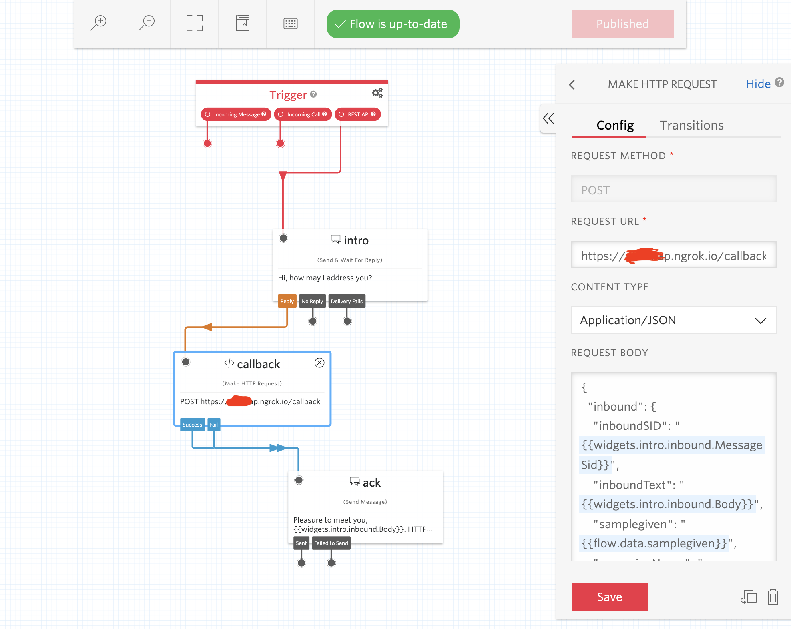
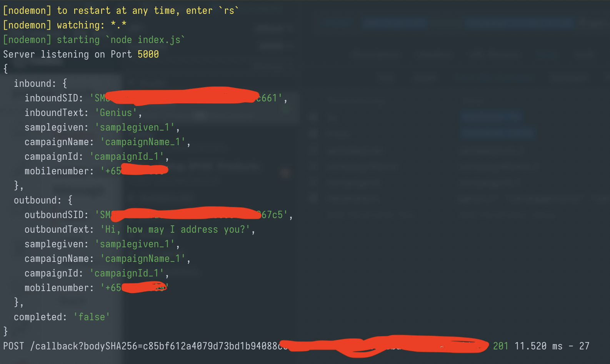
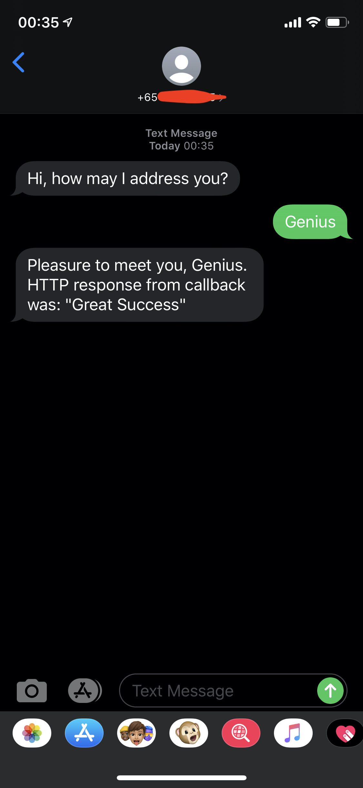

## Import studio-flow.json into Twilio Studio

https://www.twilio.com/docs/studio/user-guide#importing-flow-data

https://www.youtube.com/watch?v=pUiLcnF9YuM



## Trigger Studio Flow via REST API

```bash
curl -X "POST" "https://studio.twilio.com/v1/Flows/FW****************************/Executions" \
     -H 'Content-Type: application/x-www-form-urlencoded; charset=utf-8' \
     -u 'AC**************:************************' \
     --data-urlencode "To=+65XXXXXXXXX" \
     --data-urlencode "From=+65YYYYYYYY" \
     --data-urlencode "Parameters={\"samplegiven\": \"samplegiven_1\", \"campaignname\": \"campaignName_1\", \"campaignid\": \"campaignId_1\"}"
```

## Response captured at callback

```json
{
  "inbound": {
    "inboundSID": "SM********************c661",
    "inboundText": "Genius",
    "samplegiven": "samplegiven_1",
    "campaignName": "campaignName_1",
    "campaignId": "campaignId_1",
    "mobilenumber": "+65XXXXXXXXX"
  },
  "outbound": {
    "outboundSID": "SM******************************67c5",
    "outboundText": "Hi, how may I address you?",
    "samplegiven": "samplegiven_1",
    "campaignName": "campaignName_1",
    "campaignId": "campaignId_1",
    "mobilenumber": "+65XXXXXXXXX"
  },
  "completed": "false"
}
```



## What you should see on your phone


